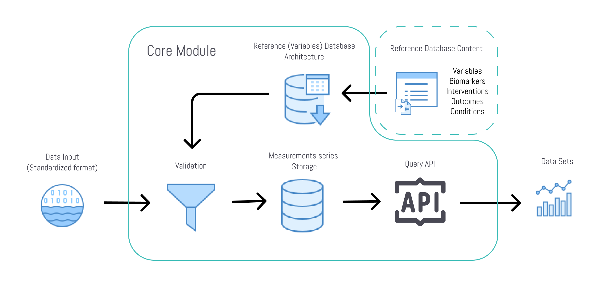

The health reference data repository is part of our core module **The Unified Health API (UHA)**, which has the main purpose to provide a single storage and query solution for the analysis of health data.

## Reference Database
To generate a common language for health data we put all health data references into a single table and call them variables. Pretty much anything quantifying a certain state of a human being could be used as health data and its analysis to find new insights.

The variables are:

- Biomarkers (Wearables, Labs, Multiomics)
- Outcomes
- Conditions, Symptoms and Diseases
- Interventions (Medication, Supplements, Therapies)
- Data from Insurance and Healthcare
- Nutritional Intake
- Environment
- Social and Digital markers
- Any other health related data

### How it works

Using **The Unified Health API (UHA)** imported data points will be mapped to a measurement schema, which pulls the reference information from this reference database to validate measurement values and to tag the data with the common identifiers.

Existing reference databases such as LOINC codes, used in healthcare for lab-tests for example, are pulled in together.
Additional information on top of these databases, such as fixed units, synonyms and cross references are necessary for the purpose of more efficient data analysis.
These additions are community maintained and version controlled for an ecosystem wide shared use to create seamless interoperability. 
The magic comes in with completely new entries, where standards are still missing. E.g. new digital biomarkers in development can be easily implemented in an own instance and published as proposal for being added to the commonly used reference.

This storage solution is also applied in applications, where users create their own marker references in a private environment, so that a seamless use of all tools in the infrastructure are still available.

## Online Data Browser

To browse the references online go to our [Online Reference Browser](https://search.curedao.org)

To browse the references in a comprehensive database visit [Reference Browser Database](https://data.curedao.org/)

Contact m@thinkbynumbers.org if you desire access.

## Reference Data Sources

### [1. Units of Measurement](reference-databases/units/units.md)

### [2. Nutritional Supplements](reference-databases/supplements/supplements.md)

### [3. Medication](reference-databases/medications/medications.md)

### [4. Conditions, Symptoms and Diseases](reference-databases/diseases/diseases.md)

### [5. Observations, Lab Test Results, and Biomarkers](reference-databases/biomarkers/biomarkers.md)

### [6. Clinical Trials](reference-databases/biomarkers/clinical-trials.md)

### [7. Medical Codes, Terms, and Synonyms](reference-databases/biomarkers/medical-codes-terms-synonyms.md)

### [8. Wearables](reference-databases/biomarkers/wearables.md)

### [9. Nutrition](reference-databases/nutrition/nutrition.md)

### [10. Unstandardized Additions](reference-databases/additions/additions.md)

## Variables Data Schema

[Variables schema documentation](sql-schema/variables.md)

[Variables schema definition](sql-schema/variables.sql)

### Git Large File Storage
This repository requires that you install the [Git Large File Storage plugin](https://git-lfs.github.com/) to store large files in Git.
